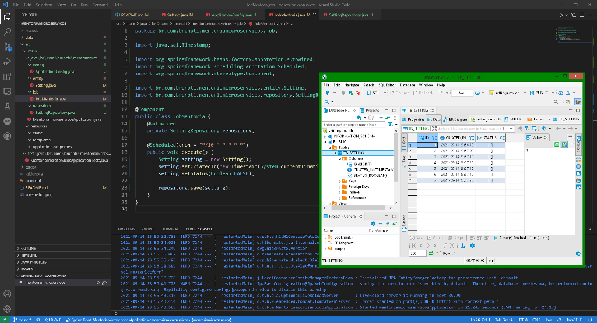

# Java Practice Microservices

- Instrutor: Leo Carvalho
- Plataforma de Ensino: https://digitalinnovation.one/sign-up?ref=K5EF2VCVKA
- Prática da Mentoria "Trabalhando com microsserviços na prática" - Dio Bootcamp Capgemini Fullstack Java and Angular

##  Objetivo

- Praticar a construção de um micro serviço do zero com Spring Boot, Java, banco de dados H2, e framework JPA para a camada de persistência dos dados.
- Micro serviço com agendamento para execução a cada 10 minutos, para armazenamento no banco de dados local, registrando um id, status booleano, e o horário do momento da execução.

## Tecnologias Utilizadas

- Microserviços
- Java 11
- Spring Initializr: Maven Project / Java 11 / Spring Boot 2.5.4 / Spring Web / Spring Data JPA / H2 Database
- @Component
- @Repository
- @Scheduling
- @Bean
- VS Code
- [DBeaver](https://dbeaver.io)

## Conteúdo apresentado

- Conceitos de Serviços e Micro Serviços
- DDD - Design de Micro Serviços
- Diferença de API e Micro Serviços
- Prática construindo um microserviço do zero

## Pesquisa Complementar

- [JPA Repositories](https://docs.spring.io/spring-data/jpa/docs/current/reference/html/#jpa.repositories)
- [O que é Spring Data JPA](https://blog.algaworks.com/spring-data-jpa/)

## Autor

- Bruno Gamba Rocha
- https://www.linkedin.com/in/bruno-gamba-rocha/
